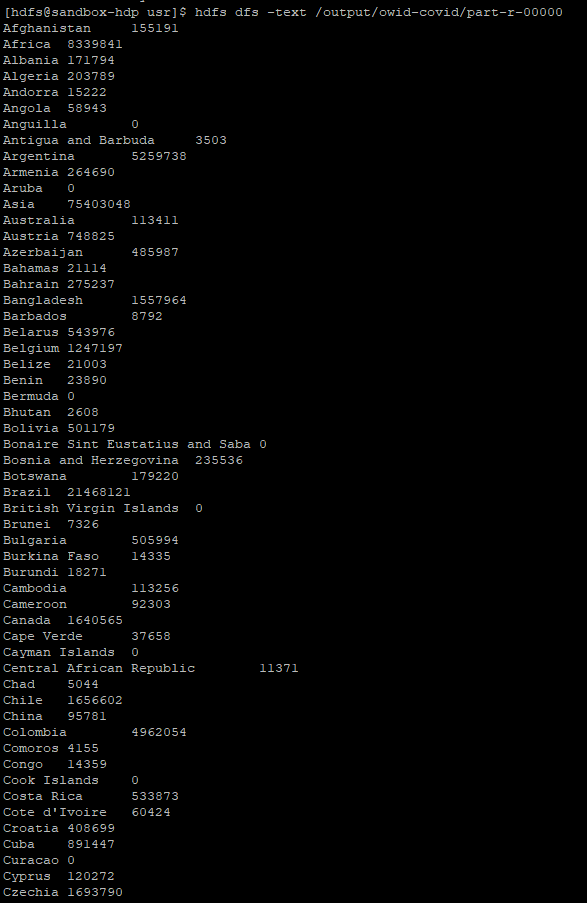

# Covid Cases - MapReduce Example - Scala

This is a simple program that sums up daily new covid cases for each country from Jan, 2020 to Sep, 2021 using MapReduce technique written in Scala.

#### Requirements:

1. sbt 1.5
2. java sdk >= 8
3. sbt-assembly 1.1.0
4. hadoop-core 1.2.1
5. IntelliJ IDEA
6. VMWare/VirtualBox
7. Hortonworks Sandbox VM

#### To get started:

1. Download the code:

        > git clone https://github.com/gnzeleven/CovidCases-MapReduce.git
       
2. Launch sbt:

        > cd CovidCases-MapReduce
        > ./sbt (or sbt.bat for Windows)
        
  This downloads all the dependencies for the project.

3. In SBT:
   
        > clean compile assembly       
        
  sbt assembly should have assembly.sbt inside the project folder(file should be in the same level as build.properties) and build.sbt in the root folder configured. Assembly will create a fat jar file in the location: target/scala-2.13/CovidCases-assembly-0.1.jar with all the required dependencies.
  assembly.sbt file should contain - addSbtPlugin("com.eed3si9n" % "sbt-assembly" % "1.1.0")
        
4. In case, you are using [Hortonworks Sandbox VM](https://www.cloudera.com/downloads/hortonworks-sandbox.html), copy the input file and the jar to the VM

        > scp -P 2222 {path/to/local/file}/filename.txt root@127.0.0.1:/home/hdfs/{some folder}
        > scp -P 2222 {path/to/local/file}/ProjectName-assembly-0.1.jar root@127.0.0.1:/home/hdfs/{some folder}

5. Create a hdfs directory for copying the local file to hdfs format
        
        > cd /home/hdfs/{some folder} 
        > hdfs dfs -mkdir /{hadoop_folder}/

    Note: {some folder} is where we copied the input file and jar file

You might want to switch to hdfs as the user(not root or any other user) by running the command <i> su hdfs </i>
        
5. Copy the file from local file format to hdfs format

        > hdfs dfs -copyFromLocal {filename} {hadoop_folder/filename}
   
6. To view hadoop folder contents, run

        > hdfs dfs -ls /{hadoop folder}/

7. To execute the jar file,

        > hadoop jar ProjectName-assembly-0.1.jar {hadoop_folder/filename} {output_folder_path}
        
   Note: The output folder path will be created during runtime.

8. To view the contents of the output folder,

        > hdfs dfs -ls {output_folder_path}
        
9. Check the output using following command,

        > hdfs dfs -text {output_folder_path}/part-r-00000

#### Sample Output:

#### License:

Distributed under the Apache License Version 2.0. See LICENSE.txt for more information.

